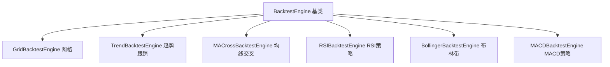
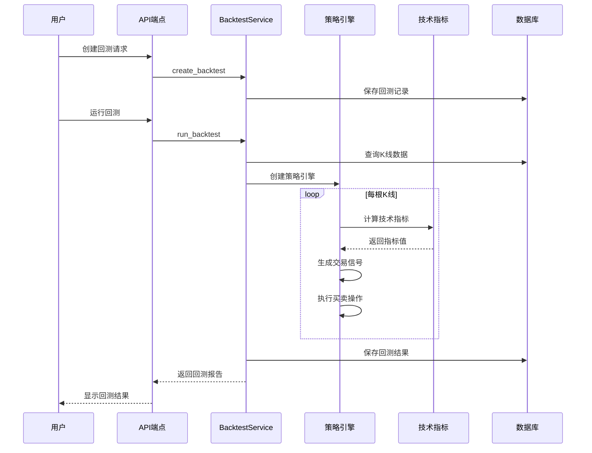

# 回测策略类型设计方案

## 一、概述

基于现有回测系统架构，设计并实现多种常用的量化交易策略类型，支持历史数据回测和性能评估。

## 二、现有架构分析

### 2.1 核心组件

| 组件 | 文件 | 职责 |
|------|------|------|
| 回测引擎基类 | [`backtest_engine.py`](backend/app/services/backtest/backtest_engine.py) | 订单撮合、资金管理、持仓管理 |
| 网格策略实现 | [`grid_backtest.py`](backend/app/services/backtest/grid_backtest.py) | 网格交易逻辑 |
| 回测服务 | [`backtest_service.py`](backend/app/services/backtest/backtest_service.py) | 协调K线数据、引擎、结果存储 |
| 指标计算 | [`metrics.py`](backend/app/services/backtest/metrics.py) | 夏普比率、最大回撤等 |

### 2.2 现有策略类型

- `grid` - 网格策略
- `grid_mm` - 网格做市策略

## 三、新增策略类型设计

### 3.1 策略类型列表



### 3.2 各策略详细设计

#### 3.2.1 趋势跟踪策略 (trend)

**策略逻辑：**
- 使用ATR（平均真实波幅）计算动态止损
- 价格突破近期高点时买入
- 价格跌破ATR倍数时卖出止损
- 支持做多和做空

**参数设计：**

| 参数名 | 类型 | 默认值 | 说明 |
|--------|------|--------|------|
| atr_period | int | 14 | ATR计算周期 |
| atr_multiplier | float | 2.0 | ATR倍数用于止损 |
| breakout_period | int | 20 | 突破判断周期 |
| position_size | float | 0.1 | 每次交易仓位比例 |
| stop_loss | float | 0.05 | 固定止损比例 |

**交易信号：**
```
买入: close > max(high, breakout_period) 且无持仓
卖出: close < entry_price - atr * atr_multiplier
```

---

#### 3.2.2 均线交叉策略 (ma_cross)

**策略逻辑：**
- 快速均线上穿慢速均线时买入（金叉）
- 快速均线下穿慢速均线时卖出（死叉）
- 可选过滤条件：价格需在均线之上/下

**参数设计：**

| 参数名 | 类型 | 默认值 | 说明 |
|--------|------|--------|------|
| fast_period | int | 5 | 快速均线周期 |
| slow_period | int | 20 | 慢速均线周期 |
| ma_type | str | EMA | 均线类型: SMA/EMA |
| amount_per_trade | float | 0.01 | 每次交易数量 |
| use_filter | bool | False | 是否使用价格过滤 |

**交易信号：**
```
买入: fast_ma上穿 slow_ma
卖出: fast_ma下穿 slow_ma
```

---

#### 3.2.3 RSI策略 (rsi)

**策略逻辑：**
- RSI低于超卖线时买入
- RSI高于超买线时卖出
- 支持背离检测（可选）

**参数设计：**

| 参数名 | 类型 | 默认值 | 说明 |
|--------|------|--------|------|
| rsi_period | int | 14 | RSI计算周期 |
| oversold | float | 30 | 超卖阈值 |
| overbought | float | 70 | 超买阈值 |
| amount_per_trade | float | 0.01 | 每次交易数量 |
| use_divergence | bool | False | 是否使用背离信号 |

**交易信号：**
```
买入: RSI < oversold 且上穿
卖出: RSI > overbought 且下穿
```

---

#### 3.2.4 布林带策略 (bollinger)

**策略逻辑：**
- 价格触及下轨时买入（均值回归）
- 价格触及上轨时卖出
- 可选突破模式：价格突破上轨追涨

**参数设计：**

| 参数名 | 类型 | 默认值 | 说明 |
|--------|------|--------|------|
| period | int | 20 | 布林带周期 |
| std_dev | float | 2.0 | 标准差倍数 |
| mode | str | reversal | 模式: reversal/breakout |
| amount_per_trade | float | 0.01 | 每次交易数量 |

**交易信号：**
```
均值回归模式:
  买入: close <= lower_band
  卖出: close >= upper_band

突破模式:
  买入: close > upper_band
  卖出: close < lower_band
```

---

#### 3.2.5 MACD策略 (macd)

**策略逻辑：**
- MACD线上穿信号线时买入
- MACD线下穿信号线时卖出
- 结合柱状图判断动能

**参数设计：**

| 参数名 | 类型 | 默认值 | 说明 |
|--------|------|--------|------|
| fast_period | int | 12 | 快速EMA周期 |
| slow_period | int | 26 | 慢速EMA周期 |
| signal_period | int | 9 | 信号线周期 |
| amount_per_trade | float | 0.01 | 每次交易数量 |

**交易信号：**
```
买入: MACD上穿 Signal 且 histogram > 0
卖出: MACD下穿 Signal 且 histogram < 0
```

---

## 四、技术指标计算模块

### 4.1 新建指标计算文件

创建 `backend/app/services/backtest/indicators.py`：

```python
class TechnicalIndicators:
    @staticmethod
    def SMA(data, period) -> List[float]:
        """简单移动平均"""
        
    @staticmethod
    def EMA(data, period) -> List[float]:
        """指数移动平均"""
        
    @staticmethod
    def RSI(close_prices, period) -> List[float]:
        """相对强弱指标"""
        
    @staticmethod
    def ATR(high, low, close, period) -> List[float]:
        """平均真实波幅"""
        
    @staticmethod
    def BollingerBands(close, period, std_dev) -> Dict:
        """布林带"""
        
    @staticmethod
    def MACD(close, fast, slow, signal) -> Dict:
        """MACD指标"""
```

## 五、实现架构

### 5.1 文件结构

```
backend/app/services/backtest/
├── __init__.py
├── backtest_engine.py      # 基类（已有）
├── grid_backtest.py        # 网格策略（已有）
├── trend_backtest.py       # 趋势跟踪策略（新增）
├── ma_cross_backtest.py    # 均线交叉策略（新增）
├── rsi_backtest.py         # RSI策略（新增）
├── bollinger_backtest.py   # 布林带策略（新增）
├── macd_backtest.py        # MACD策略（新增）
├── indicators.py           # 技术指标计算（新增）
├── metrics.py              # 性能指标（已有）
├── kline_service.py        # K线服务（已有）
└── backtest_service.py     # 回测服务（修改）
```

### 5.2 策略注册机制

修改 `backtest_service.py` 的 `_create_engine` 方法：

```python
# 策略类型注册表
BACKTEST_ENGINES = {
    'grid': GridBacktestEngine,
    'grid_mm': GridMarketMakingBacktest,
    'trend': TrendBacktestEngine,
    'ma_cross': MACrossBacktestEngine,
    'rsi': RSIBacktestEngine,
    'bollinger': BollingerBacktestEngine,
    'macd': MACDBacktestEngine,
}

def _create_engine(self, backtest: Backtest):
    engine_class = BACKTEST_ENGINES.get(backtest.strategy_type)
    if not engine_class:
        raise ValueError(f"不支持的策略类型: {backtest.strategy_type}")
    return engine_class.from_params(
        symbol=backtest.symbol,
        initial_capital=float(backtest.initial_capital),
        params=backtest.parameters or {}
    )
```

## 六、前端支持

### 6.1 策略类型选择

修改前端回测创建表单，添加策略类型选项：

```typescript
const strategyTypes = [
  { value: 'grid', label: '网格策略' },
  { value: 'grid_mm', label: '网格做市' },
  { value: 'trend', label: '趋势跟踪' },
  { value: 'ma_cross', label: '均线交叉' },
  { value: 'rsi', label: 'RSI策略' },
  { value: 'bollinger', label: '布林带策略' },
  { value: 'macd', label: 'MACD策略' },
];
```

### 6.2 动态参数表单

根据选择的策略类型，动态显示对应的参数配置表单。

## 七、实现优先级

| 优先级 | 策略类型 | 复杂度 | 说明 |
|--------|----------|--------|------|
| P0 | indicators.py | 中 | 基础设施，所有策略依赖 |
| P0 | ma_cross | 低 | 最简单，验证架构 |
| P1 | rsi | 低 | 常用指标 |
| P1 | bollinger | 低 | 常用指标 |
| P1 | macd | 中 | 常用指标 |
| P2 | trend | 高 | 需要ATR等复杂计算 |

## 八、数据流程图



## 九、待确认事项

1. **策略选择**：是否需要实现全部5种策略，还是优先实现部分？
2. **做空支持**：是否需要支持做空交易？
3. **杠杆支持**：是否需要支持杠杆交易？
4. **多品种组合**：是否需要支持多交易对组合回测？

---

请确认以上方案，或提出修改意见。
